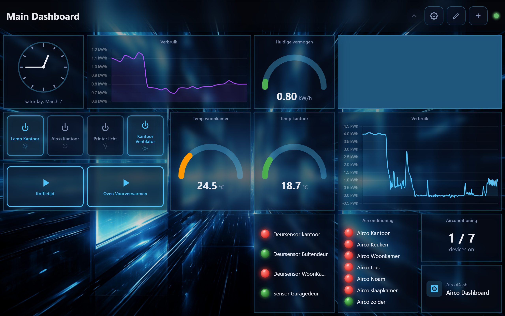
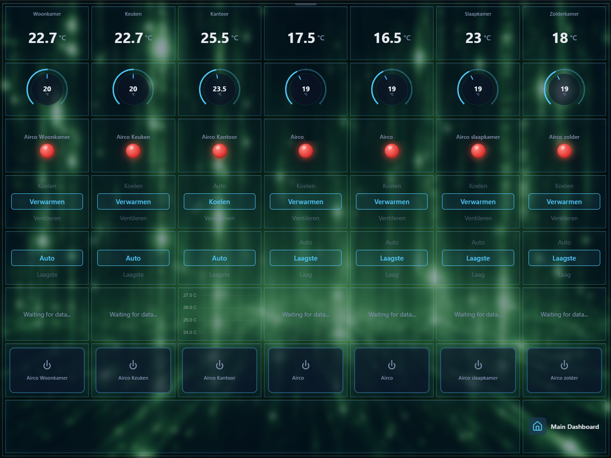
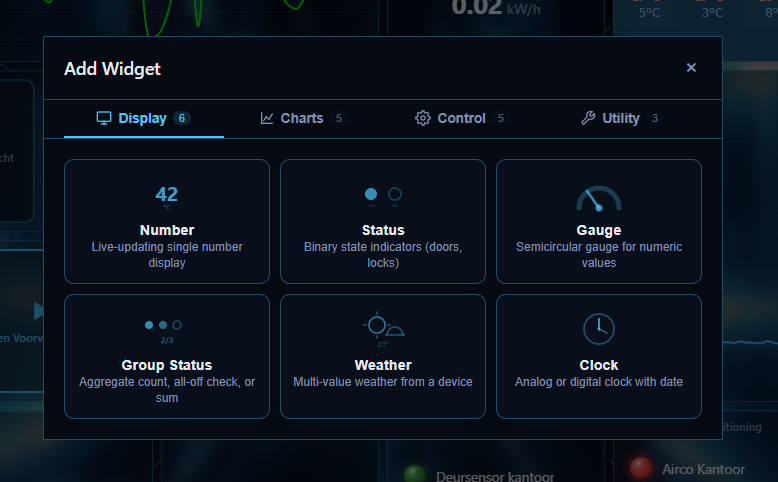
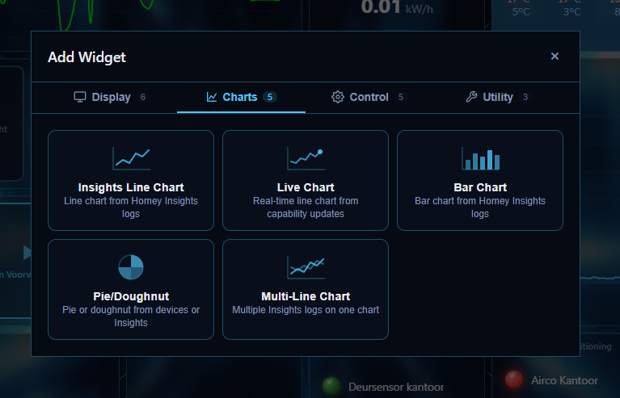
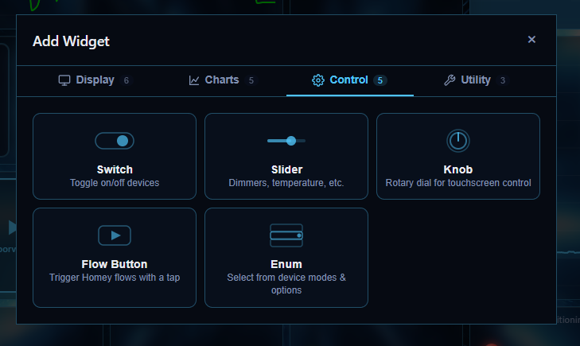
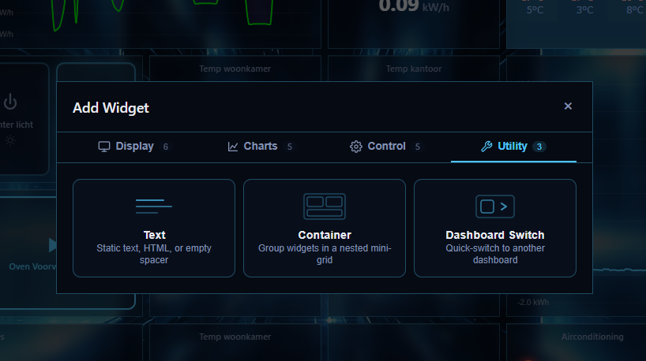
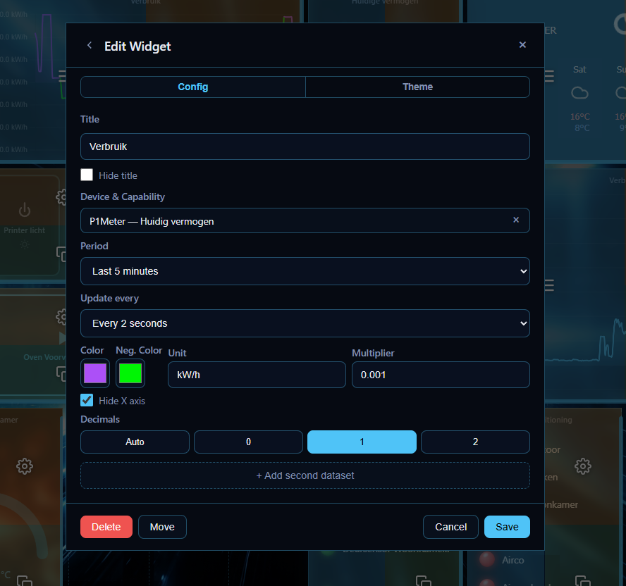
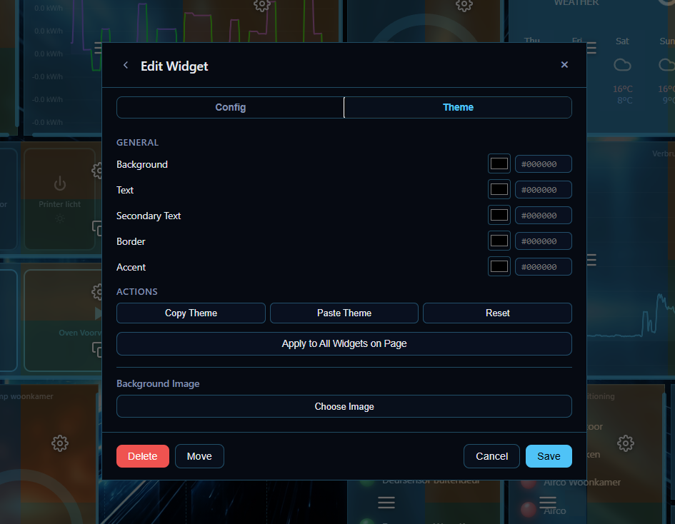
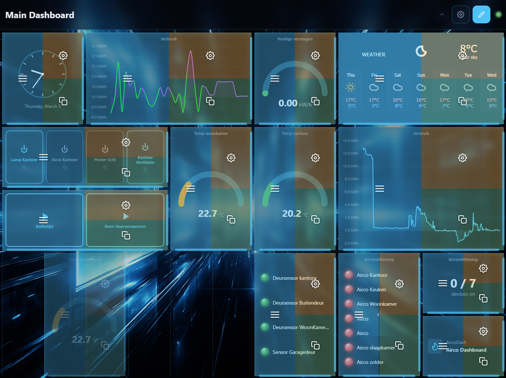
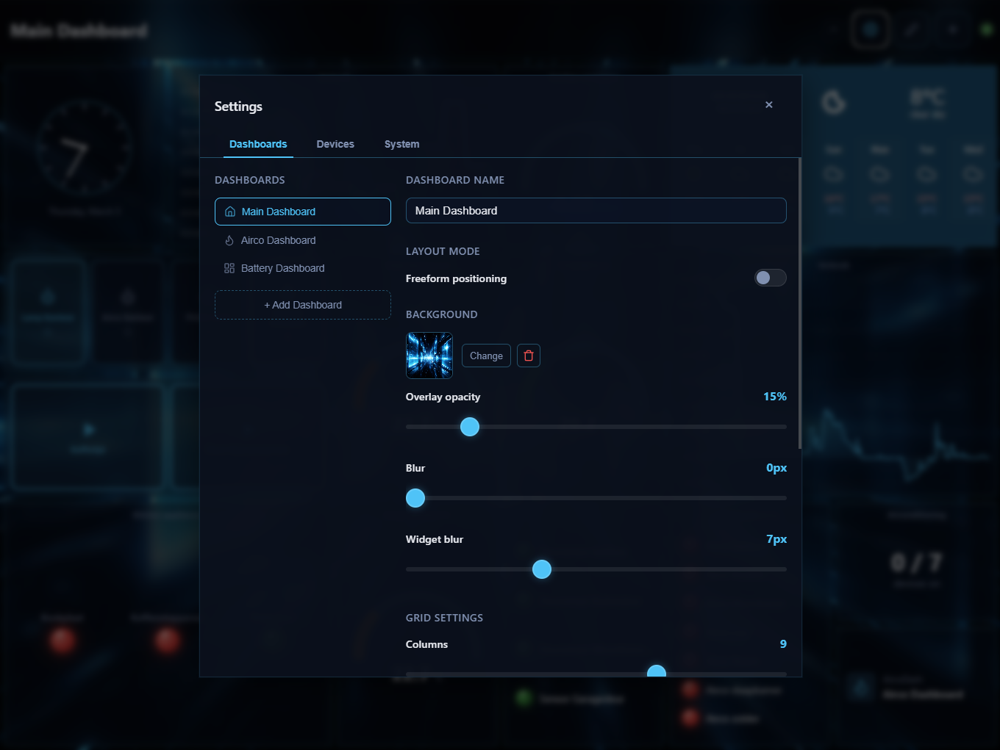

<p align="center">
  
</p>

<h1 align="center">Homey Dasher</h1>

<p align="center">
  A customizable, real-time web dashboard for <strong>Homey Pro</strong>.<br/>
  Built with Vue 3 and Fastify, designed to run on anything from a Raspberry Pi touchscreen to a NAS.
</p>

<p align="center">
  HomeyDasher connects to your Homey Pro via its local API and gives you a drag-and-drop dashboard with live state updates over Socket.io.
</p>

---

## Features

- **Real-time updates** — Device states sync instantly via Socket.io
- **Drag-and-drop dashboard editor** — Resize and position widgets freely on a configurable grid
- **Multiple dashboards** — Create separate dashboards with their own layouts and switch between them
- **Per-widget theming** — Customize colors, backgrounds, and images on every widget individually
- **Background images** — Set custom backgrounds per dashboard or per widget with blur and overlay controls
- **Backup & restore** — Export and import dashboard configurations as JSON
- **Dark themed** — Built for always-on wall-mounted displays
- **Docker ready** — Single container deployment with persistent data

### Widget Library

**19 widget types** across four categories:

| Display | Charts | Control | Utility |
|---------|--------|---------|---------|
| Number | Insights Line Chart | Switch | Text |
| Status (LED) | Live Chart | Slider | Container |
| Gauge | Bar Chart | Knob | Dashboard Switch |
| Group Status | Pie / Doughnut | Flow Button | |
| Weather | Multi-Line Chart | Enum | |
| Clock | | | |

---

## Screenshots

### Dashboard Examples

Two different dashboard layouts showing the variety of widgets working together — gauges, charts, switches, status LEDs, weather, and more.

<p align="center">
  
</p>

<p align="center">
  
</p>

### Add Widget Wizard

Widgets are organized into four categories: Display, Charts, Control, and Utility. Pick a type, configure it, and place it on the grid.

<p align="center">
  
  
</p>

<p align="center">
  
  
</p>

### Widget Configuration

Every widget has a full configuration panel. Set data sources, units, multipliers, decimals, colors, and more — all in a clean modal editor.

<p align="center">
  
</p>

### Per-Widget Theming

Each widget can be individually themed with custom colors for background, text, borders, and accent. Copy and paste themes between widgets or apply to all widgets at once. Widgets can also have their own background images.

<p align="center">
  
</p>

### Grid Editor

Drag widgets to reposition them, resize by adjusting column and row spans. The grid overlay shows available placement slots.

<p align="center">
  
</p>

### Settings

Manage multiple dashboards, configure grid dimensions, set background images with blur and overlay, and adjust widget appearance globally.

<p align="center">
  
</p>

---

## Prerequisites

- **Homey Pro** on your local network
- **Homey API token** — To generate one:
  1. Log in to [https://my.homey.app](https://my.homey.app)
  2. Go to **Settings** (cog icon at the bottom left)
  3. Click **API Keys** (or "API-Sleutels" in Dutch)
  4. Click **New API Key** ("Nieuwe API sleutel")
  5. Grant access to at least: **Devices, Flows, Variables, Zones, and Moods**. To be safe, check **Homey** at the top to grant all permissions.
- Your Homey's local IP address (e.g. `http://192.168.1.100`)

---

## Installation

### Docker (recommended)

The easiest way to run HomeyDasher. A pre-built image is available on GitHub Container Registry.

```bash
docker run -d --name=homeydasher \
  -p 3001:3001 \
  -e HOMEY_ADDRESS=http://YOUR_HOMEY_IP \
  -e HOMEY_TOKEN=YOUR_HOMEY_API_TOKEN \
  -e TZ=Europe/Amsterdam \
  -v homeydasher-data:/app/data \
  --restart always \
  ghcr.io/b03tz/homecontrol:latest
```

HomeyDasher will be available at `http://localhost:3001/`.

#### Docker Compose

Create a `docker-compose.yml`:

```yaml
services:
  homeydasher:
    image: ghcr.io/b03tz/homecontrol:latest
    container_name: homeydasher
    restart: unless-stopped
    ports:
      - "3001:3001"
    environment:
      - HOMEY_ADDRESS=http://YOUR_HOMEY_IP
      - HOMEY_TOKEN=YOUR_HOMEY_API_TOKEN
      - TZ=Europe/Amsterdam
      - DATA_DIR=/app/data
    volumes:
      - homeydasher-data:/app/data

volumes:
  homeydasher-data:
```

Then run:

```bash
docker compose up -d
```

---

### Synology NAS

#### Step 1 — Create the data folder

Open **File Station**, navigate to the `docker` folder, and create a new subfolder called `homeydasher` (all lowercase).

#### Step 2 — Create a scheduled task

Go to **Control Panel** > **Task Scheduler** > **Create** > **Scheduled Task** > **User-defined script**.

Configure the task:

- **Task:** `Install homeydasher`
- **Enabled:** Unchecked
- **User:** `root`
- **Schedule tab:** Select "Run on the following date" (leave the date as-is), set to "Do not repeat"
- **Task Settings tab:** Check "Send run details by email" and enter your email address

In the **User-defined script** field, paste the following (replace `yourHomeyIP` and `yourHomeyApiToken` with your actual values):

```bash
docker run -d --name=homeydasher \
-p 3001:3001 \
-e HOMEY_ADDRESS=http://yourhomeyIP \
-e HOMEY_TOKEN=yourHomeyApiToken \
-e TZ=Europe/Amsterdam \
-v /volume1/docker/homeydasher:/app/data \
--restart always \
ghcr.io/b03tz/homecontrol:latest
```

Save the task and press **OK** on the warning dialog. It will ask for your DSM password to confirm.

#### Step 3 — Run the task

Click the task and press the **Run** button at the top (or right-click > Run), then click **OK**.

HomeyDasher will now be installed and available at `http://YOUR_NAS_IP:3001/`.

---

### Manual installation

Requirements: **Node.js >= 18** and **pnpm**.

#### 1. Clone and install dependencies

```bash
git clone https://github.com/b03tz/HomeyDasher.git
cd HomeyDasher
pnpm install
```

#### 2. Configure environment

Create a `.env` file in the project root:

```env
HOMEY_ADDRESS=http://YOUR_HOMEY_IP
HOMEY_TOKEN=YOUR_HOMEY_API_TOKEN
```

#### 3. Development

Run the backend and frontend in dev mode:

```bash
# Terminal 1 — Backend (port 3001)
pnpm --filter @homecontrol/backend dev

# Terminal 2 — Frontend (port 5173, proxies API to backend)
pnpm --filter @homecontrol/frontend dev
```

Open `http://localhost:5173/` in your browser.

#### 4. Production build

```bash
pnpm build
node packages/backend/dist/index.js
```

The backend serves both the API and the frontend build on port **3001**.

---

## Tech stack

| Layer | Technology |
|---|---|
| Frontend | Vue 3, Vite, Pinia, Chart.js, Socket.io client |
| Backend | Fastify, Socket.io, homey-api |
| Shared | TypeScript type definitions |
| Monorepo | pnpm workspaces |

## License

This project is licensed under [CC BY-NC-ND 4.0](https://creativecommons.org/licenses/by-nc-nd/4.0/).

You are free to use and share this software with attribution. You may modify it for personal use, but you may not distribute modified versions or use it commercially.
