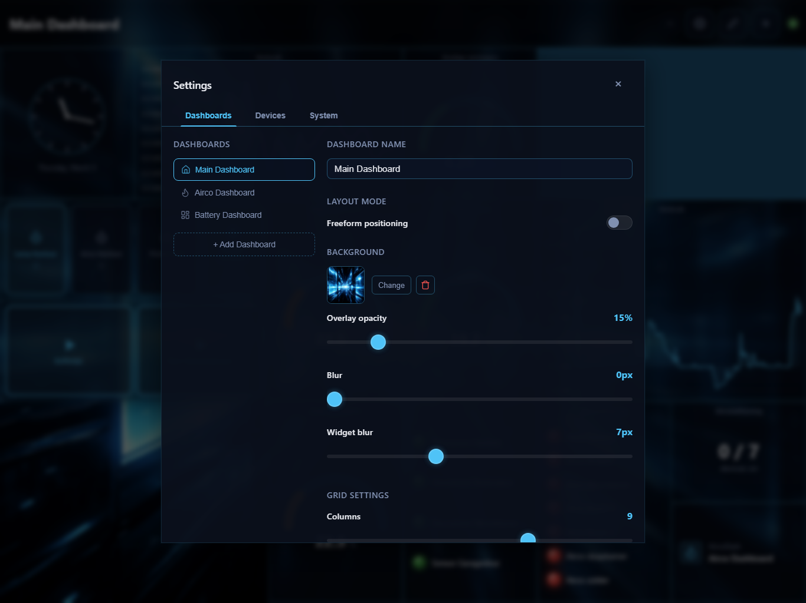
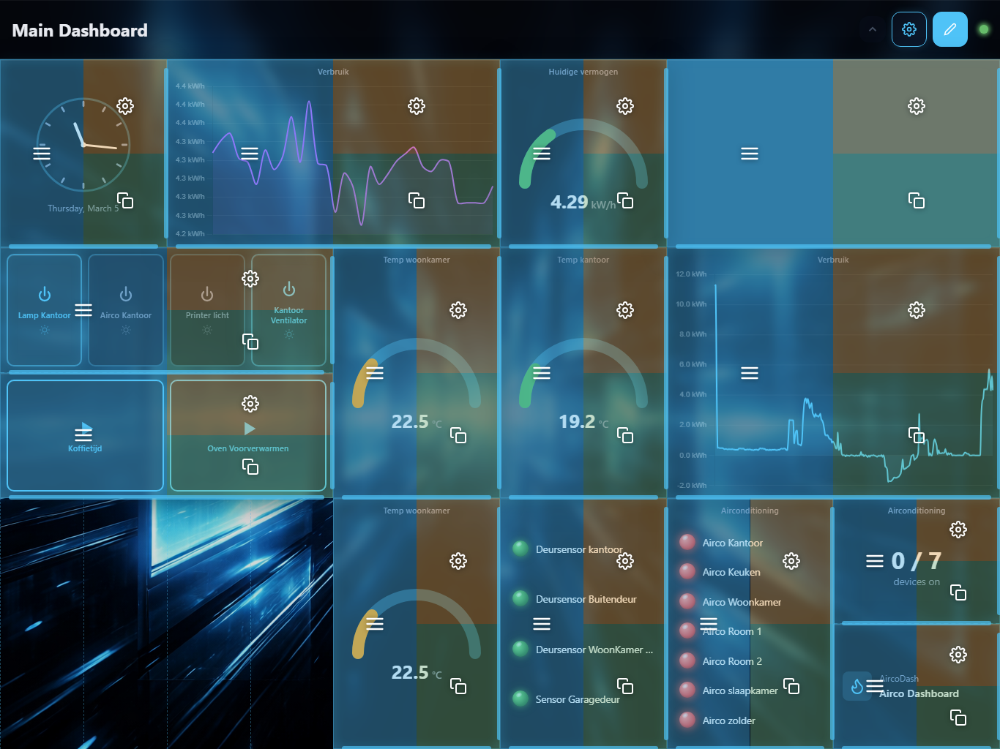

# Dashboard Management

Homey Dasher supports multiple dashboards, each with its own widgets, layout, background, and grid configuration. This guide covers how to create, configure, and manage them.

## Opening Settings

Click the **gear icon** in the top-right corner of the header to open the Settings panel. The **Dashboards** tab is where all dashboard management happens.

## Creating a Dashboard

1. Open **Settings** > **Dashboards** tab
2. Click **+ Add Dashboard** at the bottom of the dashboard list
3. A new dashboard is created with a default name
4. Click the name to edit it
5. The new dashboard is now active and ready for widgets

You can create as many dashboards as you need — for example, one per room, one for energy monitoring, one for climate, etc.

## Switching Between Dashboards

In the Settings panel, click on any dashboard in the left-hand list to switch to it. The active dashboard is highlighted.

> **Tip:** You can also add a **Dashboard Switch** widget to quickly navigate between dashboards without opening Settings. See [Widgets — Dashboard Switch](Widgets.md#dashboard-switch).

## Renaming a Dashboard

1. Open **Settings** > **Dashboards**
2. The active dashboard's name appears in the text field on the right
3. Edit the name — it saves automatically

## Changing a Dashboard Icon

Click the icon next to the dashboard name in the list. An icon picker appears with 700+ icons to choose from. The icon shows up in the dashboard list and in Dashboard Switch widgets.

## Deleting a Dashboard

1. Open **Settings** > **Dashboards**
2. Scroll to the bottom and find **Danger Zone**
3. Double-click **Delete dashboard** within 3 seconds to confirm

> You cannot delete the last remaining dashboard. At least one must always exist.

---

## Layout Modes

Each dashboard can use one of two layout modes.

### Grid Layout (default)

Widgets snap to a configurable grid. This is the best option for most setups — it keeps everything aligned and works well on different screen sizes.

- Widgets have a position (column, row) and size (column span, row span)
- No overlapping — widgets claim their grid cells
- Clean, uniform look

### Freeform Layout

Widgets are positioned freely using pixel coordinates. Use this when you need exact control over placement or want overlapping widgets.

- Widgets have an (x, y) position and (width, height) in pixels
- No collision detection — widgets can overlap
- Best for large displays or creative layouts

### Switching Layout Mode

In **Settings** > **Dashboards**, toggle the **Layout Mode** switch between Grid and Freeform.

> When switching modes, widget data is preserved but the coordinate system changes. You may need to reposition widgets after switching.

---

## Grid Settings

These options are available when using Grid layout mode.

### Columns and Rows

Control the grid dimensions:

- **Columns:** 3 to 12 (default: 12)
- **Rows:** 3 to 12 (default: 12)

A 12x12 grid gives you the most flexibility. Reduce it for simpler layouts or smaller screens.

### Grid Spacing (Gap)

The space between grid cells, from 0 to 25 pixels (default: 12px). Set to 0 for a seamless look, or increase for more breathing room.

### Border Radius

Corner roundness of all widget cards, from 0 to 12 pixels (default: 12px). Set to 0 for sharp corners.

### Show Borders

Toggle the 1px border on widget cards on or off (default: on).

---

## Dashboard Background

Each dashboard can have its own background image.

### Setting a Background

1. Open **Settings** > **Dashboards**
2. Under **Background**, click **+ Choose Image**
3. Pick from previously uploaded images or upload a new one
4. The background is applied immediately

### Background Options

| Option | Range | Default | Description |
|--------|-------|---------|-------------|
| Overlay Opacity | 0–100% | 40% | Dark overlay on top of the image to improve widget readability |
| Blur | 0–20px | 0px | Gaussian blur applied to the background image |
| Widget Blur | 0–20px | 18px | Backdrop blur on widget cards — makes widgets slightly translucent with the background showing through |

- **High overlay opacity** darkens the background significantly, making text easier to read
- **Widget blur** creates a frosted-glass effect on widget cards
- Set widget blur to 0 for fully opaque widget backgrounds

### Removing a Background

Click the remove/clear button next to the current background image to go back to the default dark background.

---

## Uploading Images

Images can be uploaded for dashboard backgrounds or individual widget backgrounds.

- Supported formats: JPEG, PNG, GIF, WebP, SVG
- Maximum file size: 10 MB
- Images are stored on the server and persist across restarts (in the `data/dashboards/uploads/` directory)
- Previously uploaded images appear in the image picker for reuse

---

## Edit Mode

Toggle edit mode by clicking the **pencil icon** in the header. When edit mode is active:

- Widgets show drag handles and configuration zones
- You can move, resize, configure, and duplicate widgets
- The pencil icon is highlighted to indicate edit mode is on

Click the pencil icon again to exit edit mode and return to the normal view.

### Moving Widgets

**Grid mode:** Drag the left half of a widget to move it to a new grid position.

**Freeform mode:** Drag anywhere on the widget to reposition it.

### Resizing Widgets

**Grid mode:** Drag the right edge to change column span, or the bottom edge to change row span.

**Freeform mode:** Drag any of the 8 edges or corners to resize freely.

### Duplicating Widgets

In edit mode, click the duplicate zone (lower-right area of the widget). A copy is created and enters placement mode — click where you want to place it.

### Resetting Widget Locations

If your layout gets messy, go to **Settings** > **Dashboards** > **Danger Zone** and click **Reset widget locations**. This rearranges all widgets sequentially on the grid.

---

## Next Steps

- **[Add widgets to your dashboard](Widgets.md)**
- **[Customize widget colors and backgrounds](Theming.md)**
- **[Export your dashboards as a backup](Backup-and-Restore.md)**
