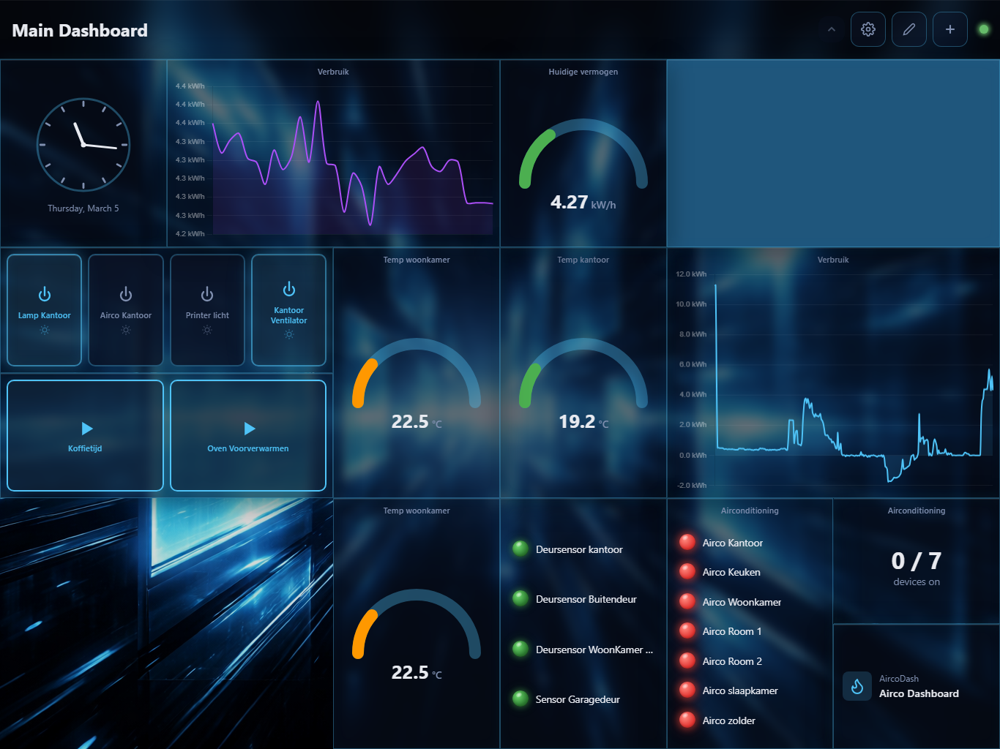

# Homey Dasher Wiki

Welcome to the Homey Dasher documentation. This guide covers everything from first install to building custom dashboards.

## What is Homey Dasher?

Homey Dasher is a customizable, real-time web dashboard for **Homey Pro**. It connects to your Homey via the local API and provides a drag-and-drop interface with live device state updates. It's designed to run on anything from a Raspberry Pi touchscreen to a Synology NAS — wherever you can run Docker or Node.js.

## Contents

1. **[Getting Started](Getting-Started.md)** — Prerequisites, generating an API token, and installation (Docker, Synology, manual)
2. **[Dashboard Management](Dashboard-Management.md)** — Creating dashboards, switching between them, layout modes, grid settings, and backgrounds
3. **[Widgets](Widgets.md)** — All 20 widget types explained, how to add/edit/remove widgets, and every configuration option
4. **[Theming](Theming.md)** — Per-widget colors, background images, and copy/paste themes
5. **[Backup and Restore](Backup-and-Restore.md)** — Exporting and importing your dashboard configurations

## Quick Overview

| Feature | Details |
|---------|---------|
| Real-time updates | Device states sync instantly via Socket.io |
| Widget library | 20 types across Display, Charts, Control, and Utility categories |
| Layout modes | Grid (snap-to-grid) and Freeform (pixel-perfect positioning) |
| Multiple dashboards | Each with its own layout, widgets, and background |
| Per-widget theming | Custom colors, background images, blur, and overlay per widget |
| Containers | Nest widgets inside other widgets for organized layouts |
| Backup & restore | Export/import all dashboards as a single JSON file |
| Dark theme | Built for always-on, wall-mounted displays |

## Tech Stack

| Layer | Technology |
|-------|------------|
| Frontend | Vue 3, Vite, Pinia, Chart.js, Socket.io |
| Backend | Fastify, Socket.io, homey-api |
| Deployment | Docker (multi-arch: amd64 + arm64) |
