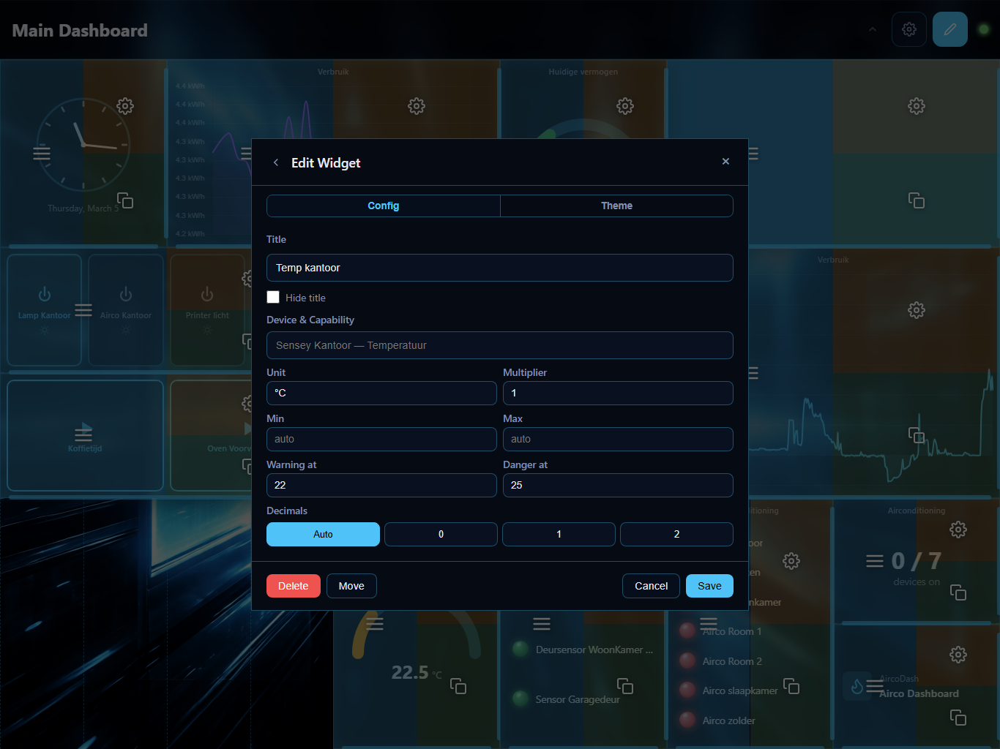

# Theming

Every widget in Homey Dasher can be individually themed with custom colors and background images. This lets you create dashboards that match your style or use color to group related widgets.

## Opening the Theme Editor

1. Enter **edit mode** (pencil icon in the header)
2. Click the right half of a widget to open its settings panel
3. Look for the **Theme** section in the settings

## Themeable Colors

Each widget supports these color overrides:

| Color | What it affects |
|-------|----------------|
| **Background** | Widget card background |
| **Foreground** | Primary text (values, titles) |
| **Secondary Text** | Units, labels, hints, secondary information |
| **Border** | Widget card border |
| **Accent** | Interactive elements — slider tracks, knob arcs, gauge arcs, button highlights |
| **Sub Background** | Secondary backgrounds inside the widget — toggle buttons, status dots, nested elements |
| **Slider Fill** | The filled portion of slider tracks (left of the thumb) |

Each color can be set as a hex value with an optional alpha (transparency) slider from 0–100%.

Leave a color empty to use the dashboard default.

## Copy and Paste Themes

To reuse a theme across widgets:

1. Open the theme editor on the widget you want to copy **from**
2. Click **Copy** — the theme is saved to your clipboard
3. Open the theme editor on another widget
4. Click **Paste** — the copied colors are merged into the target widget

> Only the colors you've set are copied. Unset colors remain unchanged on the target widget.

## Apply to All Widgets

Click **Apply to All** in the theme editor to apply the current widget's theme to every widget on the dashboard. This includes widgets inside containers.

## Clearing a Theme

Click **Clear** to remove all custom colors from a widget and revert to the dashboard defaults.

## Per-Widget Background Images

In addition to colors, each widget can have its own background image — independent of the dashboard background.

### Setting a Widget Background

1. Open the widget's settings in edit mode
2. In the **Background Image** section, click **Choose Image**
3. Pick from previously uploaded images or upload a new one

### Background Image Options

| Option | Range | Default | Description |
|--------|-------|---------|-------------|
| Overlay Opacity | 0–100% | 40% | Dark overlay to keep text readable over the image |
| Blur | 0–20px | 0px | Gaussian blur applied to the image |

**Tips:**
- Use a high overlay opacity (60–80%) for widgets with lots of text
- A slight blur (2–4px) can help the image feel less busy
- Combine with a semi-transparent background color for tinted overlays

## Visual Hierarchy

When both dashboard and widget backgrounds are set, the layering is:

1. **Dashboard background** (with dashboard blur and overlay)
2. **Widget card** (with widget blur / backdrop-filter from dashboard settings)
3. **Widget background image** (with its own overlay and blur)
4. **Widget content** (text, charts, controls)

## Device Name Overrides

Not strictly theming, but useful for presentation: you can override the display name of any device.

1. Open **Settings** > **Devices** tab
2. Select a zone from the left panel
3. Find the device and edit its name
4. Click **Save** — the override applies everywhere the device name appears

Click **Clear** to revert to the original Homey device name.
