# Widgets

Homey Dasher comes with **19 widget types** organized into four categories: Display, Charts, Control, and Utility. This guide covers how to add, configure, and manage widgets, followed by a detailed reference for every widget type.

## Adding a Widget

1. Make sure you're **not** in edit mode (the pencil icon should not be highlighted)
2. Click the **+** button in the header
3. The **Add Widget** wizard opens with four tabs: Display, Charts, Control, and Utility

| 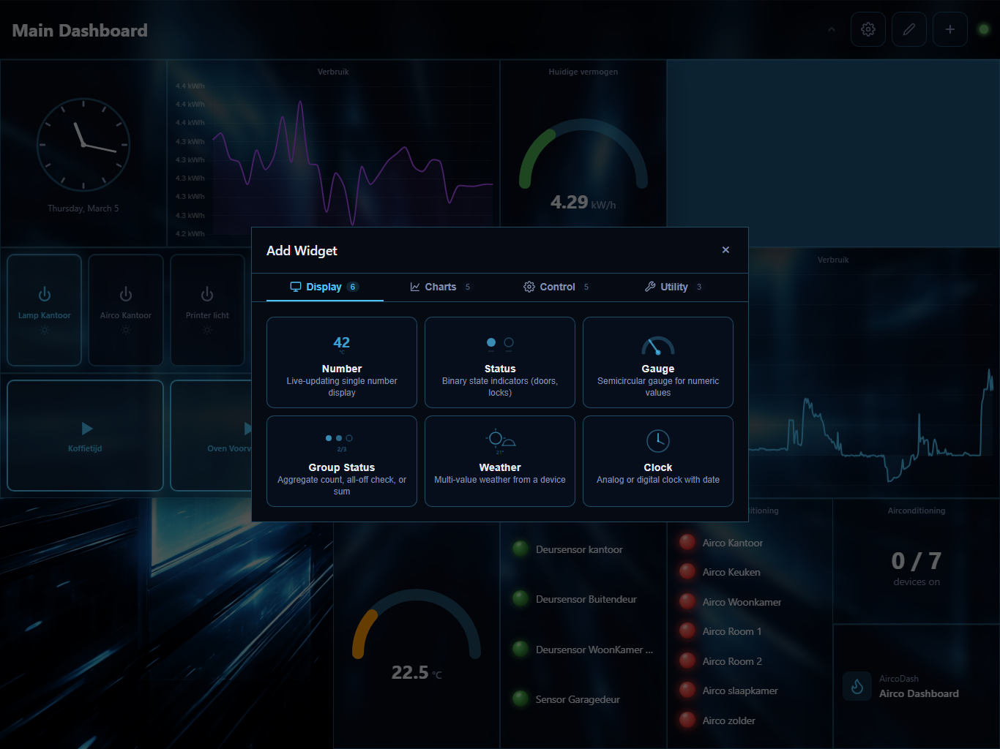 | 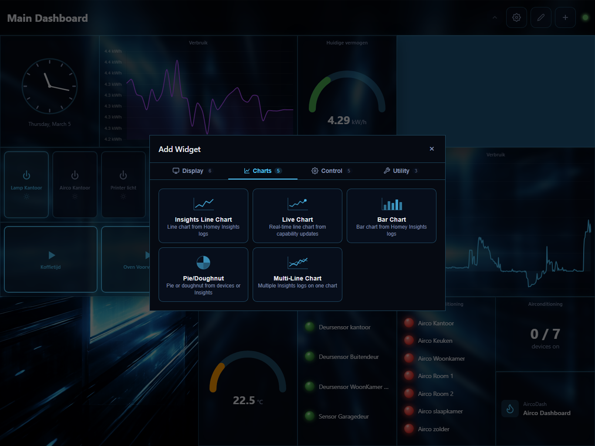 |
|---|---|
| 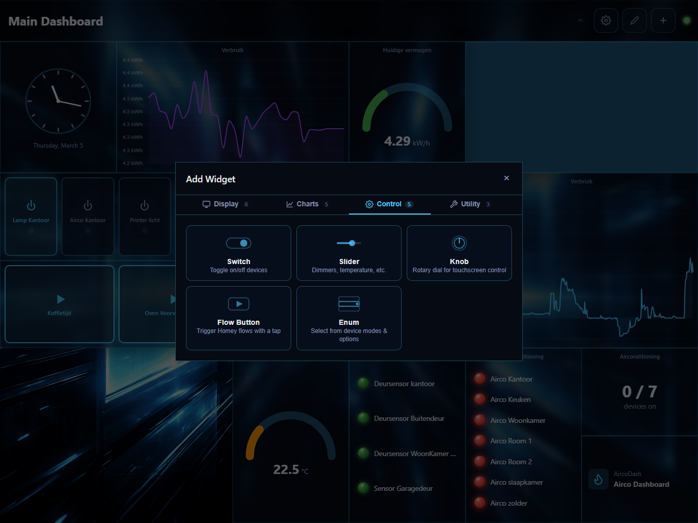 | 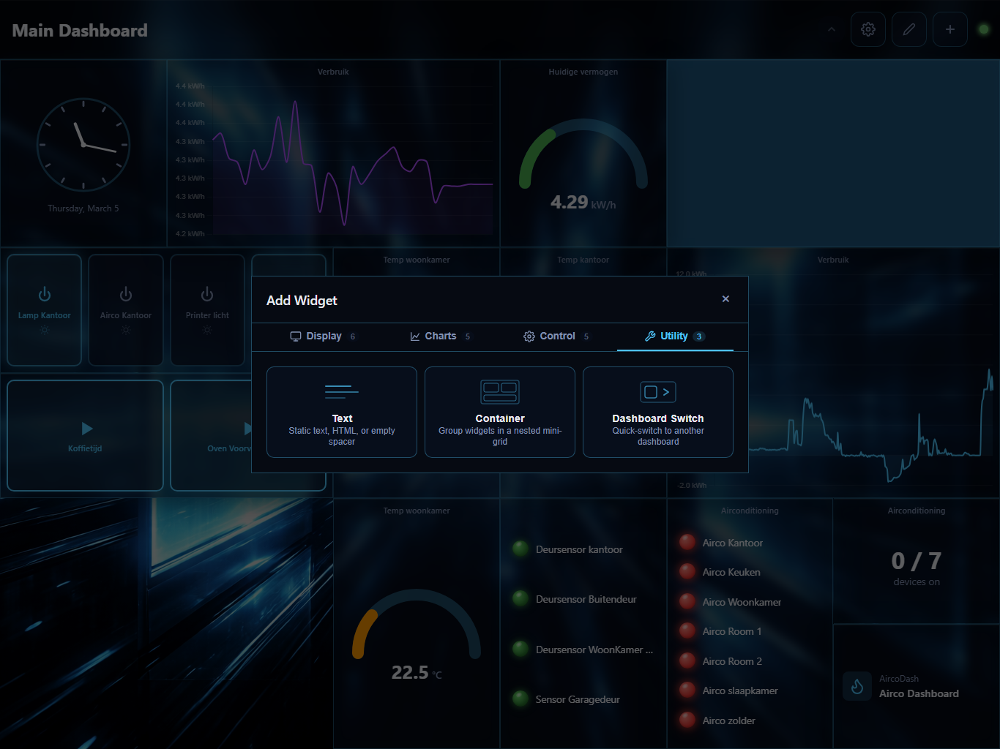 |

4. Click the widget type you want to add
5. A configuration panel appears — fill in the required settings (device, capability, etc.)
6. Click confirm to enter **placement mode**
7. Click the grid cell (grid layout) or position (freeform layout) where you want the widget

> Press **Escape** to cancel placement at any time.

## Configuring a Widget

1. Enter **edit mode** (pencil icon in the header)
2. Click the right half of the widget to open its settings panel
3. Adjust the configuration and close the panel — changes save automatically

Every widget has a **Title** field and a **Hide Title** toggle. The title appears at the top of the widget card. Hide it for a cleaner look when the widget's content is self-explanatory.

## Removing a Widget

1. Enter edit mode
2. Open the widget's settings panel
3. Click the delete/remove option and confirm

---

# Widget Reference

## Display Widgets

Display widgets show device data in read-only form. They update in real-time as device states change.

---

### Number

Displays a single numeric value from a device capability.

| Setting | Description |
|---------|-------------|
| Device & Capability | The device and numeric capability to display |
| Unit | Label shown after the value (e.g. "W", "kWh", "°C") |
| Multiplier | Multiply the raw value (e.g. `0.001` to convert W to kW) |
| Size | Small (1 column), Medium (2 columns), or Large (3 columns) |
| Decimals | Auto, 0, 1, or 2 decimal places |

**Use for:** Energy readings, temperature sensors, humidity, luminance — any single numeric value.

---

### Status

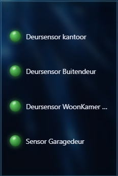

Shows binary (on/off) state indicators for up to 16 devices. Think of it as a quick overview of door sensors, locks, or motion detectors.

| Setting | Description |
|---------|-------------|
| Devices | Up to 16 device + capability pairs |
| Display Mode | **Columns** (dot above label) or **LED List** (name on left, dot on right) |
| Reverse Colors | Swap the on/off colors (useful when "on" means "closed" for a door sensor) |

**Use for:** Door/window sensors, motion detectors, lock status, alarm zones.

---

### Gauge

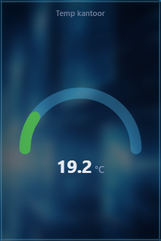

A semicircular gauge for numeric values with optional warning and danger thresholds.

| Setting | Description |
|---------|-------------|
| Device & Capability | The numeric capability to display |
| Unit | Label below the value |
| Multiplier | Value multiplier |
| Min / Max | Gauge range (uses capability defaults if not set) |
| Decimals | 0, 1, or 2 decimal places |
| Warning Threshold | Value at which the gauge turns orange |
| Danger Threshold | Value at which the gauge turns red |

**Use for:** Power consumption, CPU temperature, humidity levels — anything where you want visual ranges.

---

### Group Status

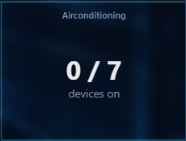

Aggregate view of multiple devices in a single widget.

| Setting | Description |
|---------|-------------|
| Devices | Up to 24 device + capability pairs |
| Mode | **Count** ("3/5 on"), **All Off** (checkmark if all off, X if any on), or **Sum** (total of all values) |
| Unit | Unit label (Sum mode) |
| Multiplier | Value multiplier (Sum mode) |

**Use for:**
- **Count mode:** "How many lights are on?"
- **All Off mode:** "Is everything off?" indicator
- **Sum mode:** Total power consumption across multiple devices

---

### Weather

Multi-value weather display from a single weather device. Automatically detects and shows available capabilities.

| Setting | Description |
|---------|-------------|
| Device | A weather-class device on your Homey |

Displays whatever the device provides: temperature, humidity, pressure, wind speed, precipitation, etc. Each value gets its own row with an icon.

**Use for:** Weather stations, outdoor sensors.

---

### Clock

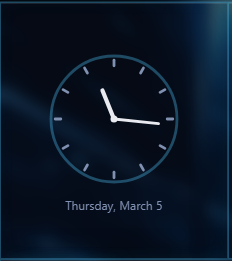

Analog or digital clock with optional date display.

| Setting | Description |
|---------|-------------|
| Style | **Analog** (circle with hands) or **Digital** (text) |
| Display | Time only, Date only, or Both |
| Show Seconds | Include seconds (updates every second when enabled) |
| 24-Hour Format | Use 24-hour time instead of AM/PM |

**Use for:** Wall-mounted dashboards where a clock is handy.

---

## Chart Widgets

Chart widgets visualize historical data from Homey's Insights system or real-time capability values.

---

### Insights Line Chart

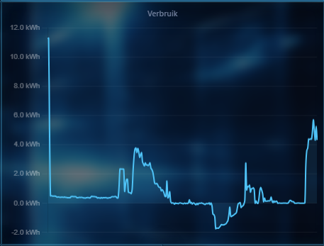

A line chart showing historical data from a Homey Insights log.

| Setting | Description |
|---------|-------------|
| Insights Log | The Insights log to chart (e.g. energy usage of a specific device) |
| Resolution | Time range: Last hour, 6 hours, 24 hours, 7/14/31 days |
| Unit | Y-axis label |
| Multiplier | Value multiplier |
| Color | Line color |
| Decimals | Tooltip decimal places |
| Hide X-Axis | Remove the time axis for a cleaner look |
| Secondary Series | Optional second Insights log with its own color, unit, and multiplier |

**Use for:** Energy usage over time, temperature trends, any historical data.

---

### Bar Chart

Same data as the line chart, but visualized as bars.

| Setting | Description |
|---------|-------------|
| (Same as Insights Line Chart) | All the same options apply |

**Use for:** When bars make the data easier to read than lines (e.g. daily energy totals).

---

### Pie / Doughnut Chart

Multiple data slices from device values or Insights logs.

| Setting | Description |
|---------|-------------|
| Style | **Pie** or **Doughnut** (hollow center) |
| Slices | Up to 8 slices, each sourced from a device capability or an Insights log |
| Per-slice settings | Label, color, source type (device or insights) |
| Resolution | Time range for Insights-sourced slices |
| Aggregation | **Sum** or **Average** for Insights data |
| Unit / Multiplier / Decimals | Value formatting |

**Use for:** Energy distribution across devices, proportional comparisons.

---

### Multi-Line Chart

Multiple Insights logs on a single chart with a shared time axis.

| Setting | Description |
|---------|-------------|
| Series | Up to 6 Insights logs, each with its own color, unit, and multiplier |
| Resolution | Time range |
| Hide X-Axis | Remove the time axis |
| Decimals | Tooltip decimal places |

**Use for:** Comparing multiple data sources — e.g. indoor vs outdoor temperature, or energy across rooms.

---

### Live Chart

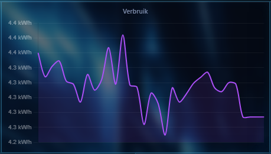

Real-time line chart that updates as device values change (via Socket.io, not Insights).

| Setting | Description |
|---------|-------------|
| Device & Capability | The numeric capability to chart |
| Period | Time window: Last 1, 5, 30 minutes, or last hour |
| Update Interval | **Live** (every value change), or sampled at 2s / 5s / 10s / 30s / 1 minute |
| Unit / Multiplier | Value formatting |
| Color | Line color |
| Negative Color | Separate color for values below zero |
| Hide X-Axis | Remove the time axis |
| Decimals | Decimal places |
| Secondary Series | Optional second device/capability |

**Use for:** Power monitoring, real-time solar production, any value that changes frequently.

---

## Control Widgets

Control widgets let you interact with your Homey devices — toggle switches, adjust values, and trigger flows.

---

### Switch

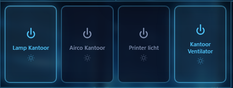

Toggle buttons for up to 8 on/off devices. Each device can optionally show a slider for a secondary numeric capability.

| Setting | Description |
|---------|-------------|
| Devices | Up to 8 devices with a boolean (on/off) capability |
| Per-device slider | Auto-detected: dim, target temperature, or first numeric setable capability |

Tap the toggle to switch on/off. If a slider is shown, drag it to adjust the secondary value (e.g. brightness).

**Use for:** Lights, appliances, heaters — anything with an on/off switch.

---

### Slider

A horizontal slider for controlling a single numeric value.

| Setting | Description |
|---------|-------------|
| Device & Capability | A setable numeric capability |
| Unit | Label next to the current value |
| Min / Max | Slider range (uses capability defaults if not set) |
| Step | Increment step |

**Use for:** Brightness, volume, target temperature, fan speed.

---

### Knob

A rotary dial for controlling a numeric value. Designed for touchscreen use.

| Setting | Description |
|---------|-------------|
| Device & Capability | A setable numeric capability |
| Unit | Label |
| Min / Max / Step | Range and increment |

The knob has a 270-degree sweep. For capabilities with a 0–1 range (like dim), it automatically displays as 0–100%.

**Use for:** Same as slider, but with a circular UI that works well on touch displays.

---

### Enum

Select a value from a device's predefined option list.

| Setting | Description |
|---------|-------------|
| Device & Capability | A setable enum capability |
| Display Mode | **Popup** (dropdown selector) or **Scroll** (inline scrollable list) |

**Use for:** Thermostat modes (heat/cool/auto), washing machine programs, any capability with a fixed set of options.

---

### Flow Button

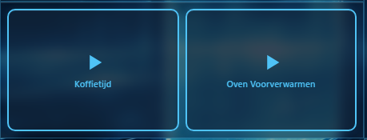

Trigger one or more Homey flows with a single tap.

| Setting | Description |
|---------|-------------|
| Flows | Up to 8 flows, each with an optional custom label and button color |

Tap a button to trigger the flow immediately.

**Use for:** Scene activation ("Movie night", "Good morning"), manual automations, or any flow you want quick access to.

---

## Utility Widgets

---

### Text

Static text content or a blank spacer.

| Setting | Description |
|---------|-------------|
| Content | Plain text or HTML |
| HTML Mode | When enabled, renders content in an iframe (supports scripts) |

Leave the content empty to use it as an invisible spacer for layout purposes.

**Use for:** Labels, section headers, custom HTML embeds, or spacing between widgets.

---

### Container

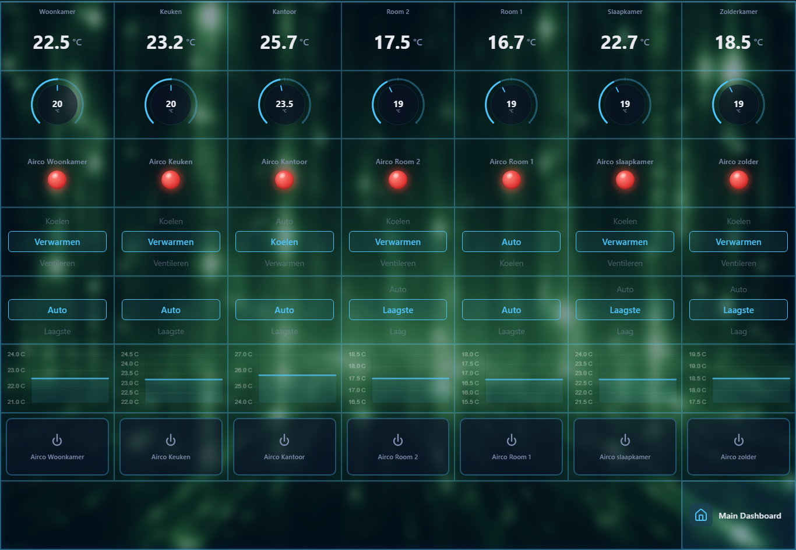

A nested mini-grid that holds other widgets inside it. Useful for grouping related controls.

| Setting | Description |
|---------|-------------|
| Grid Columns | 2 to 8 columns for the inner grid |
| Grid Rows | 1 to 8 rows for the inner grid |

After adding a container:

1. Open its settings in edit mode
2. Click **Edit Contents**
3. A full-screen editor opens — add, arrange, and configure widgets just like on the main dashboard
4. Close the editor to return to the dashboard

All 19 widget types can be placed inside a container, including other containers.

**Use for:** Grouping a room's controls together, creating reusable widget clusters, organizing complex dashboards.

---

### Dashboard Switch

A button that navigates to another dashboard.

| Setting | Description |
|---------|-------------|
| Target Dashboard | The dashboard to switch to |

Shows the target dashboard's name and icon. Tap to switch. Disabled during edit mode to prevent accidental navigation.

**Use for:** Navigation between dashboards — e.g. a "Rooms" overview dashboard with buttons linking to per-room dashboards.

---

## Next Steps

- **[Customize widget appearance with theming](Theming.md)**
- **[Back up your dashboards](Backup-and-Restore.md)**
